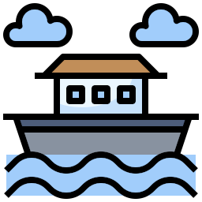
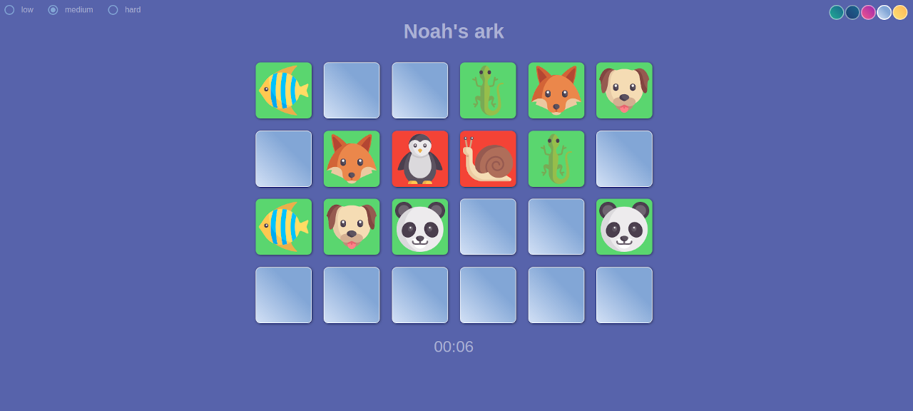

# Noah's ark



[](/LICENSE)

---

Desktop and web game built with vanilla js and Electron.



## 📝 Table of Contents

- [Getting Started](#getting_started)
- [Built Using](#built_using)
- [Contributing](../CONTRIBUTING.md)
- [Authors](#authors)

## 🏁 Getting Started <a name = "getting_started"></a>

### Installing

```
git clone https://github.com/MOTORIST/noahs-ark.git
cd noahs-ark && yarn install
```

### Start
```
# web
yarn start

# electron
yarn start:el
```

### Build

```
# web (public/web)
yarn build

# electron (dist)
yarn build:el
```

## 🔧 Running the tests <a name = "tests"></a>

```
yarn test
```

## ⛏️ Built Using <a name = "built_using"></a>

- [Electron](https://electronjs.org/)

## ✍️ Authors <a name = "authors"></a>

- [@MOTORIST](https://github.com/MOTORIST)
